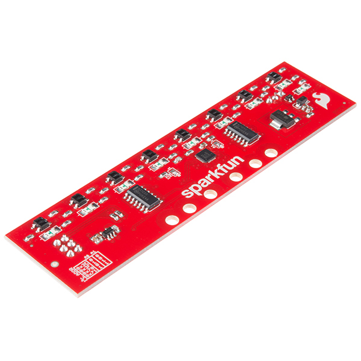
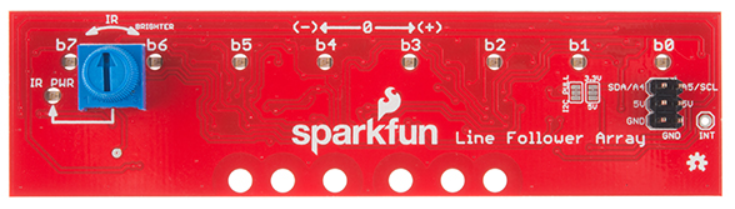
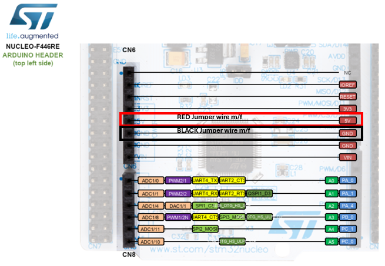
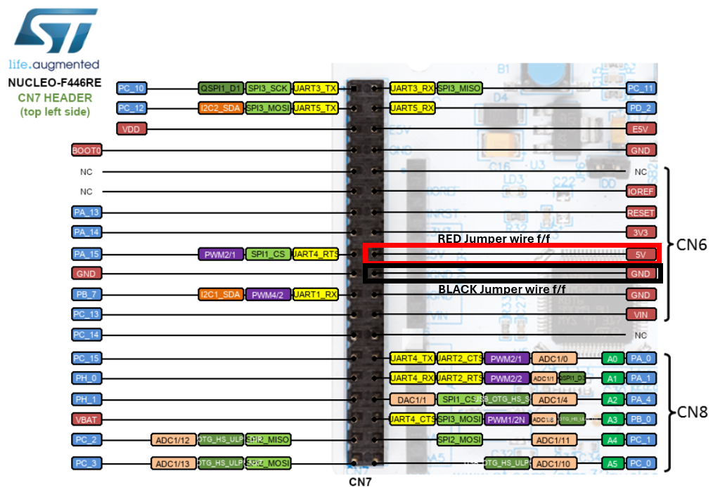
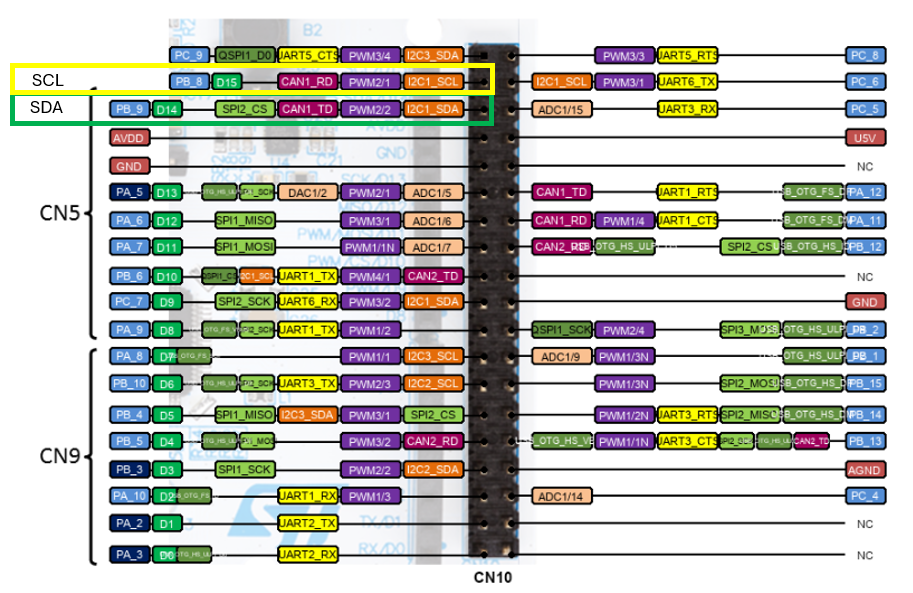

<!-- link list -->
[0]: https://www.sparkfun.com/products/13582
[1]: https://learn.sparkfun.com/tutorials/sparkfun-line-follower-array-hookup-guide
[2]: https://learn.sparkfun.com/tutorials/serial-peripheral-interface-spi/all
[3]: https://os.mbed.com/platforms/ST-Nucleo-F446RE/

# Line Follower

## Line Follower Array

The sensor features eight diodes for line detection, with each diode's illumination indicating the presence of a black surface beneath it. Its sensitivity can be adjusted via an on-board potentiometer, allowing customization for specific applications and environments. The sensor communicates via an I2C interface, making it easy to integrate with the PES board. Its low power consumption makes it suitable for battery-powered applications, while its compact size and lightweight design make it ideal for small robots.

<p align="center">
     </br>
    <i>Line Follower Array</i>
</p>

## Technical Specifications

| Sparkfun Line follower sensor array |             |
| ----------------------------------- | ----------- |
| Sensor Number                       | 8           |
| Interface                           | I2C         |
| Supply Voltage                      | 5 V         |
| Supply Current                      | 25 - 185 mA |
| Read Cycle Time                     | 3.2 ms      |
| Measurement Distance                | 1-2 mm      |

### Important Notes

The measurement distance depends on the surface color and the ambient light conditions. The sensitivity can be adjusted via an on-board potentiometer, allowing customization for specific applications and environments. Best practice is to perform some experiments to find the best sensitivity and distance from the surface for your application.

## Links

- [Sparkfun Line Follower Sensor Array][0] <br>
- [Sparkfun Line Follower Hookup Guide][1]

## Datasheets

- [Sparkfun Line Follower Sensor Array](../datasheets/line_follower_array.pdf)

## **WARNING**

<b>Before attempting to connect the sensor, it is important to carefully review the section [Connection to the PES Board](line_follower.md#connection-to-the-pes-board). This sensor is highly sensitive, and mishandling during the connection will lead to destruction of the sensor. Therefore, caution is necessary to avoid damaging the unit!</b>

### Connection to the PES Board

As the communication protocol, I2C is used. I2C relies on a data pin and a clock pin (more information can be found [here][2]). To power the sensor, a voltage of 5V is required.

Use the following pins directly on the Nucleo board to connect the sensor:

- SCL (Clock Line): **PB_8**
- SDA (Data Line): **PB_9**

The pinmap from the Nucleo board can be found here: [Mbed ST-Nucleo-F446RE][3]

<b>As mentioned above, this sensor is highly sensitive, and incorrect connections may cause damage. It is very important to carefully review the provided images that illustrate the correct way to connect the sensor.</b> <br>

<b>If possible, connect a red power cable to the pin labeled 5V and a black ground cable to the pin labeled GND.</b>
<p align="center">
     </br>
    <i>Line Follower Sensor Look from Above</i>
</p>

To plug the power source, you will need to use:

- 2 m/f jumper wires (black and red)
<p align="center">
     </br>
    <i>Line Follower Sensor M/F Connection</i>
</p>

- or

<p align="center">
     </br>
    <i>Line Follower Sensor F/F Connection</i>
</p>

- and 2 f/f jumper wires (green and yellow) for the I2C communication

<p align="center">
     </br>
    <i>SDA and SCL Pin Connection</i>
</p>

## Sensor Bar Driver to create your own Line Following Algorithm

If you just want to drive the robot, you normally do **not** talk to the ``SensorBar`` directly—use the higher-level ``LineFollower`` class instead (see below), which wraps the same sensor interface and exposes the measurements you need. The ``SensorBar`` section stays here for those who want to build their own controller from scratch.

Include the necessary driver in the ***main.cpp*** file

```cpp
#include "SensorBar.h"
```

and create a variable for the distance from the wheel axis to the LEDs on the sensor bar/array and a ``SensorBar`` object with the pin names for the I2C communication

- SCL (Clock Line): **PB_8**
- SDA (Data Line): **PB_9**

```cpp
// sensor bar
const float bar_dist = 0.114f; // distance from wheel axis to leds on sensor bar / array in meters
SensorBar sensor_bar(PB_9, PB_8, bar_dist);
```

***IMPORTANT NOTE:***

Make sure you do not include

```cpp
DigitalOut led1(PB_9);
```

after creating the sensor bar object, as this is in conflict with the sensor bar pins. Better use another available pin for an additional led if you intend to use it.

#### Sensor Bar Usage

If you want to read out the angle of the line relative to the robot and only update the variable ``angle`` when the line is detected, you need to define a variable to store the angle. This variable should be updated in the main loop when the line is detected. The actual angle is calculated in the driver and can be accessed by the user.

```cpp
// angle measured from sensor bar (black line) relative to robot
float angle{0.0f};
```

The sensor bar driver provides functionality to read the sensor values and calculate the angle of the line relative to the robot's orientation.

```cpp
// only update sensor bar angle if an led is triggered
if (sensor_bar.isAnyLedActive())
    angle = sensor_bar.getAvgAngleRad();
```

You can now use this angle to control the robot velocities.

### Additional Sensor Bar Functionality

The ``SensorBar`` driver provides the following features. All these values are returned as floating-point numbers in the range from 0.0 to 1.0, where 0.0 represents no light detected and 1.0 represents maximum light detected.

- **Averaged Bit Values**: The driver calculates the average filtered bit values for each sensor, which can be accessed using the ``getAvgBit(int bitNumber)`` method, where ``bitNumber`` ranges from 0 to 7 and starts from the leftmost sensor (0) to the rightmost sensor (7). This allows for a more stable reading of the sensor values, reducing noise and fluctuations.
- **Mean of the Three Leftmost Sensors**: The driver calculates the mean of the three leftmost sensors using the ``getMeanThreeAvgBitsLeft()`` method.
- **Mean of the Three Rightmost Sensors**: The driver calculates the mean of the three rightmost sensors using the ``getMeanThreeAvgBitsRight()`` method.
- **Mean of the Four Center Sensors**: The driver calculates a weighted mean of the four center sensors using the ``getMeanFourAvgBitsCenter()`` method.
- **Mean of the Four Outer Sensors**: The driver calculates the mean of the two leftmost and two rightmost sensors using the ``getMeanFourAvgBitsOuter()`` method.

Use the following code snippet to print the averaged bit values and the means of the left, center, and right sensors to the serial terminal.

```cpp
// print to the serial terminal
printf("Averaged Bar Raw: |  %0.2f  | %0.2f |  %0.2f |  %0.2f |  %0.2f |  %0.2f |  %0.2f |  %0.2f | ", sensor_bar.getAvgBit(0)
                                                                                                     , sensor_bar.getAvgBit(1)
                                                                                                     , sensor_bar.getAvgBit(2)
                                                                                                     , sensor_bar.getAvgBit(3)
                                                                                                     , sensor_bar.getAvgBit(4)
                                                                                                     , sensor_bar.getAvgBit(5)
                                                                                                     , sensor_bar.getAvgBit(6)
                                                                                                     , sensor_bar.getAvgBit(7));
printf("Mean Left: %0.2f, Mean Center: %0.2f, Mean Right: %0.2f, Mean Outer: %0.2f \n", sensor_bar.getMeanThreeAvgBitsLeft()
                                                                                      , sensor_bar.getMeanFourAvgBitsCenter()
                                                                                      , sensor_bar.getMeanThreeAvgBitsRight()
                                                                                      , sensor_bar.getMeanFourAvgBitsOuter());
```

### Using Eigen Library (Linear Algebra)

You can use the Eigen library for linear algebra operations. The library is used for matrix operations, such as matrix multiplication and inversion, which are essential for the kinematic calculations in the driver.

As usual include the library in the ***main.cpp*** file.

```cpp
#include <Eigen/Dense>

#define M_PIf 3.14159265358979323846f // pi
```

Now you're able to define the mapping from wheel velocity to the robot velocities as a 2x2 matrix using the following code snippet. Check out [Tutorial Differential Drive Robot Kinematics](dd_kinematics.md) for more information.

```cpp
// differential drive robot kinematics
const float r_wheel = 0.0563f / 2.0f; // wheel radius in meters
const float b_wheel = 0.13f;          // wheelbase, distance from wheel to wheel in meters
// transforms wheel to robot velocities
Eigen::Matrix2f Cwheel2robot;
Cwheel2robot <<  r_wheel / 2.0f   ,  r_wheel / 2.0f   ,
                 r_wheel / b_wheel, -r_wheel / b_wheel;
```

Usually, the control law to follow a line is implemented with respect to the robot, so translational forward velocity and angular velocity.

We define the maximum wheel velocity in radians per second as a constant and a simple proportional controller for the angle, which is used to control the robot's angular velocity.

```cpp
// rotational velocity controller
const float Kp{5.0f};
const float wheel_vel_max = 2.0f * M_PIf * motor_M2.getMaxPhysicalVelocity();
```

We are now able to implement a control law according to:

```cpp
// control algorithm for robot velocities
Eigen::Vector2f robot_coord = {0.5f * wheel_vel_max * r_wheel,  // half of the max. forward velocity
                               Kp * angle                    }; // simple proportional angle controller
```

Which is driving the robot forward with half of the maximum forward velocity and turning it with a proportional controller based on the angle measured by the sensor bar.

Now we can transform the velocities with respect to the robot to wheel speeds using:

```cpp
// map robot velocities to wheel velocities in rad/sec
Eigen::Vector2f wheel_speed = Cwheel2robot.inverse() * robot_coord;
```

In the above code snippet, the variable ``robot_coord`` is a 2x1 ``Eigen::Vector2f`` vector containing the robot translational forward velocity and the angular velocity. The resulting ``wheel_speed`` vector contains the right and left wheel velocities in radians per second.

To send the wheel speeds as setpoints to the dc motors we simply use:

```cpp
// setpoints for the dc motors in rps
motor_M1.setVelocity(wheel_speed(0) / (2.0f * M_PIf)); // set a desired speed for speed controlled dc motors M1
motor_M2.setVelocity(wheel_speed(1) / (2.0f * M_PIf)); // set a desired speed for speed controlled dc motors M2
```

**NOTE:**
- The simple control law above is just an example. You can implement your own control law to follow the line based on the angle measured by the sensor bar. Think about a nonlinear proportional controller for the angle and a control law for the forward velocity that alters the forward velocity based on the angle. The more the robot deviates from the line, the slower it should drive forward. This way, you can implement a more robust and faster line following algorithm.

### Example

- [Example Line Follower Base](../solutions/main_line_follower_base.cpp)

## Line Follower Driver

The ``LineFollower`` driver is designed to drive (control) a differential drive robot with a line follower array attached along a black line on white background.

To start using the ``LineFollower`` driver, the initial step in the ***main.cpp*** file is to create the ``LineFollower`` object and specify the pins to which the object will be assigned.

To set up the module in the main function, it's necessary that you define two DC motor objects. To do so, please see the instructions provided in [Tutorial DC Motor](dc_motor.md). Code snippets that should be placed in the correct places:

```cpp
#include "DCMotor.h"
```

```cpp
// create object to enable power electronics for the dc motors
DigitalOut enable_motors(PB_ENABLE_DCMOTORS);

const float voltage_max = 12.0f; // maximum voltage of battery packs, adjust this to
                                    // 6.0f V if you only use one battery pack
const float gear_ratio = 100.00f;
const float kn = 140.0f / 12.0f;
// motor M1 and M2, do NOT enable motion planner when used with the LineFollower (disabled per default)
DCMotor motor_M1(PB_PWM_M1, PB_ENC_A_M1, PB_ENC_B_M1, gear_ratio, kn, voltage_max);
DCMotor motor_M2(PB_PWM_M2, PB_ENC_A_M2, PB_ENC_B_M2, gear_ratio, kn, voltage_max);
```

**NOTE:**
- Follow the instructions **Motor M2 Closed-Loop Velocity Control** in [Tutorial DC Motor](dc_motor.md#motor-m2-closed-loop-velocity-control)
- The control algorithm in the ``LineFollower`` driver works best if the motion planner for the DC motors is disabled (default).

### Create Line Follower Object

Initially, it's essential to add the suitable driver to our ***main.cpp*** file and then create an object with the following input arguments:

- sda_pin - I2C data line pin
- scl_pin - I2C clock line pin
- bar_dist - Distance between sensor bar and wheelbase in meters.
- d_wheel - Diameter of the wheels in meters.
- b_wheel - Wheelbase (distance between the wheels) in meters.
- max_motor_vel_rps - Maximum motor velocity in rotations per second.

The remaining values are defined by default, but there is a possibility to change some of the parameters, as described below the description of the internal algorithm.

```cpp
#include "LineFollower.h"
```

```cpp
const float d_wheel = 0.0372f; // wheel diameter in meters
const float b_wheel = 0.156f;  // wheelbase, distance from wheel to wheel in meters
const float bar_dist = 0.114f; // distance from wheel axis to leds on sensor bar / array in meters
// line follower, tune max. vel rps to your needs
LineFollower lineFollower(PB_9, PB_8, bar_dist, d_wheel, b_wheel, motor_M2.getMaxPhysicalVelocity());
```

### Line Follower Sensor Interface (no direct SensorBar needed)

The ``LineFollower`` object already exposes the sensor readings that the raw ``SensorBar`` provides, so students do not need to include ``SensorBar.h`` or manage it themselves. Useful accessors:

- Line angle: ``getAngleRadians()`` / ``getAngleDegrees()``
- Detection state: ``isLedActive()`` (true if any diode sees the line)
- Per-diode intensity: ``getAvgBit(int bit)`` with bit ``0..7`` left→right
- Precomputed means: ``getMeanThreeAvgBitsLeft()``, ``getMeanThreeAvgBitsRight()``, ``getMeanFourAvgBitsCenter()``, ``getMeanFourAvgBitsOuter()``

### Parameter Adjustments

The ``LineFollower`` class provides functionality to dynamically adjust the following parameters:

1. Proportional Gain (Kp) and Non-linear Gain (Kp_nl):
- Function: ``void setRotationalVelocityControllerGains(float Kp, float Kp_nl)``
- Parameters: ``Kp`` and ``Kp_nl``
- Description: These parameters define the proportional and non-linear proportional gain (squared) in the robot's angular velocity controller, allowing the user to fine-tune the response to deviations from the desired line angle.

2. Maximum Wheel Velocity:
- Function: ``void setMaxWheelVelocity(float wheel_vel_max)``
- Parameter: ``wheel_vel_max``
- Description: This parameter limits the maximum wheel velocity (argument in rotations per second), indirectly affecting the robot's linear and angular velocities. The user can adjust this limit to tune the performance of their system.

### Driver Usage

The driver determines the speed values for each wheel. These speed values are expressed in revolutions per second, allowing direct control of the motors. Below is the code that should be executed when the **USER** button is pressed.

```cpp
enable_motors = 1;

// setpoints for the dc motors in rps
motor_M1.setVelocity(lineFollower.getRightWheelVelocity()); // set a desired speed for speed controlled dc motors M1
motor_M2.setVelocity(lineFollower.getLeftWheelVelocity());  // set a desired speed for speed controlled dc motors M2
```

Don't forget to reset when the **USER** button is pressed again.

```cpp
enable_motors = 0;
```

**NOTE:**
- The ``LineFollower`` class assumes that the right motor is M1 and the left motor is M2 (sitting on the robot and looking forward) and that a positive speed setpoint to the motor M1 and M2 will rotate the robot positively around the z-axis (counter-clockwise seen from above).

Below, you'll find an in-depth manual explaining the inner driver functions. While it's not mandatory to use this manual, familiarizing yourself with the content will certainly help. For enhanced comprehension, it's recommended to refer to the [Tutorial Differential Drive Robot Kinematics](dd_kinematics.md) document.

### Thread Algorithm Description

The ``followLine()`` function is a thread task method responsible for controlling the robot to follow a line based on sensor readings.

1. Thread Execution: The ``followLine()`` method runs continuously in a thread loop. It waits for a thread flag to be set before executing, indicating that it should perform the task.

2. Sensor Reading: Inside the ``while()`` loop, the method checks if any LEDs on the sensor bar are active. If any LEDs are active, it calculates the average angle of the detected line segments relative to the robot's orientation. This angle is stored in ``m_angle``.

3. Control:
- The maximum wheel velocity in radians per second is calculated based on the maximum wheel velocity in rotations per second (``m_wheel_vel_max_rps``).
- The rotational velocity (``m_robot_coord(1)``) is determined using a control ``ang_cntrl_fcn()`` function, which adjusts the robot's orientation to align it with the detected line.
- The translational velocity (``m_robot_coord(0)``) is determined using a second control ``vel_cntrl_fcn()`` function, which calculates the robot's forward velocity based on the rotational velocity and geometric parameters.
- The robot's wheel speeds are calculated using the inverse of ``m_Cwheel2robot``.

4. Wheel Velocity Conversion: The calculated wheel speeds are converted from radians per second to revolutions per second (``m_wheel_right_velocity_rps`` and ``m_wheel_left_velocity_rps``).

#### Angular Velocity Controller

The ``ang_cntrl_fcn()`` function is responsible for calculating the angular velocity of the robot based on the detected angle of the line relative to the robot's orientation. This function uses proportional linear and non-linear control law to calculate the velocity based on the measured angle.

1. Input Parameters:
- ``Kp``: Proportional gain parameter for angular control.
- ``Kp_nl``: Non-linear gain parameter for angular control.
- ``angle``: The angle of the detected line relative to the robot's orientation.

2. Calculation:
- We apply ``ang_vel = Kp * angle + Kp_nl * angle * fabsf(angle)``

#### Linear Velocity Controller

The ``vel_cntrl_fcn()`` function calculates the linear velocity of the robot based on its angular velocity and geometric parameters. The function ensures that one of the robot's wheels always turns at the maximum velocity specified by the user while the other adjusts its speed to maintain the desired angular velocity.

1. Input Parameters:
- ``wheel_vel_max``: Maximum wheel speed in radians per second.
- ``rotation_to_wheel_vel``: Geometric parameter related to the distance between the wheels.
- ``robot_ang_vel``: Angular velocity of the robot.
- ``Cwheel2robot``: Transformation matrix from wheel to robot coordinates.

2. Calculation:
- If ``robot_ang_vel`` is positive, it assigns the maximum wheel speed to the first wheel and calculates the speed for the second wheel by subtracting ``2 * b * robot_ang_vel`` from the maximum speed.
- If ``robot_ang_vel`` is negative or zero, it assigns the maximum wheel speed to the second wheel and calculates the speed for the first wheel by adding ``2 * b * robot_ang_vel`` to the maximum speed.
- The function then calculates the robot's coordinate velocities by multiplying the transformation matrix ``Cwheel2robot`` to the wheel speeds.
- Finally, it returns the linear velocity of the robot, which corresponds to the velocity along the x-axis in the robot's coordinate system.

3. Output:
- The function returns the calculated linear velocity of the robot.

## Example

- [Example Line Follower](../solutions/main_line_follower.cpp)
